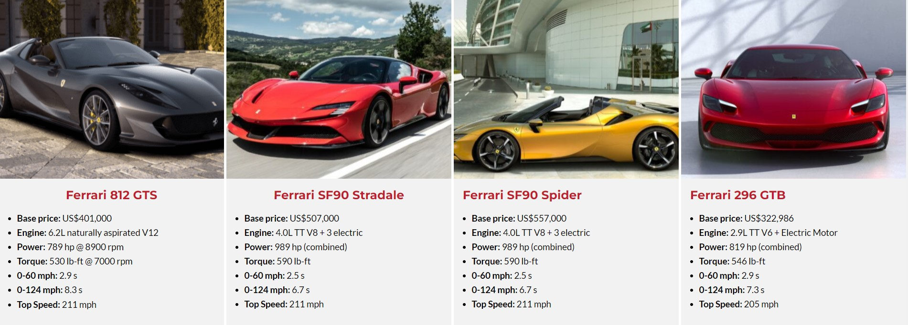

# Every Ferrari Ever Made - Web Scraping, Data Cleaning and Analysis
## Python (Pandas, BeautifulSoup4, Requests), MS Excel and Power BI

This project is based around web scraping data from this website: https://www.supercars.net/blog/all-brands/ferrari/ferrari-model-list/

Please read the main **Jupyter Notebook** file, with all of the contents of this project, providing a step-by-step overview:
[Jupyter Notebook: Ferrari Data Scraping](https://github.com/wolanindaw/ferrari_python_web_scraping/blob/main/src/ferrari_data_scraping.ipynb)

A part of this project is also the .xlsx Excel file, containing the cleaned datasetets that were scraped:
[Excel File](https://github.com/wolanindaw/ferrari_python_web_scraping/blob/main/cleaned_scraped_ferrari_data.xlsx)

The datasets were then cleaned using Excel and visualized using Power BI:

[Power BI Dashboard](https://github.com/wolanindaw/ferrari_python_web_scraping/blob/main/ferrari_all_models_analysis.pbix)

This interactive dashboard allows the user to quickly visualize the evolution of technical specs and trends for different types of engine configurations of all Ferrari road car models (V8, V12, etc.).

Main findings include:
 - Recent electrification across some of the Ferrari model range is showing by outlying, high power values without the need for increasing the engine displacement.
 - Trend analysis would suggest that there will be more Ferrari V12 models with additional electric motors, increasing the overall power output.
 - The recent addition of a V6 hybrid engine in the lineup (in the Ferrari 296 GTB) proves that the performance figures of previous V12 models can be matched, with much smaller engine displacement. This leaves the V8 platforms' future uncertain, as the V6 arrangement provides weight saving and manufacturing simplification opportunities.
